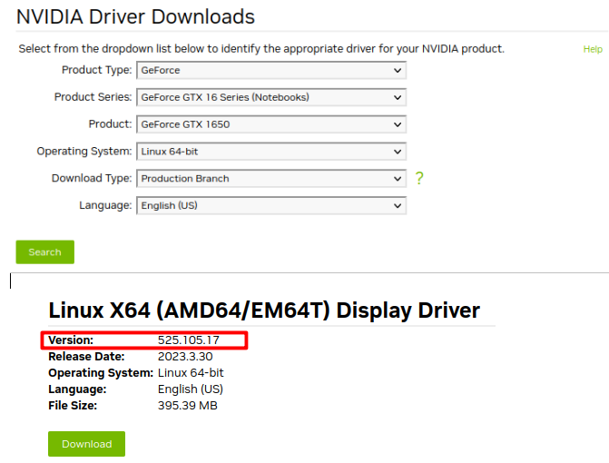
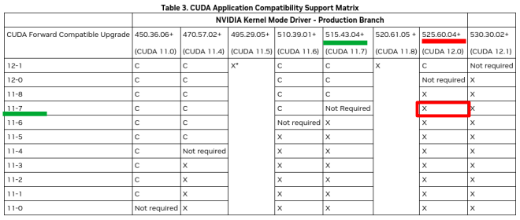
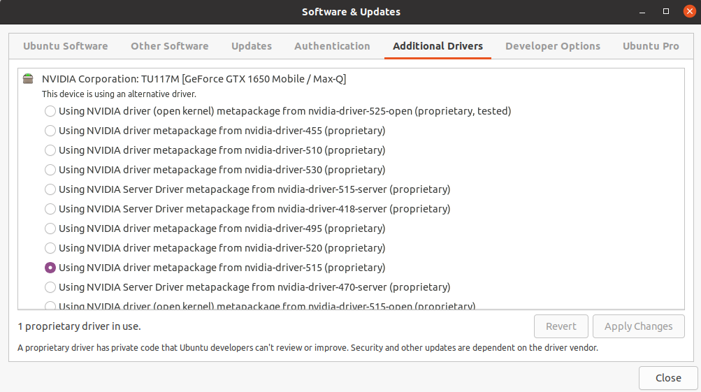
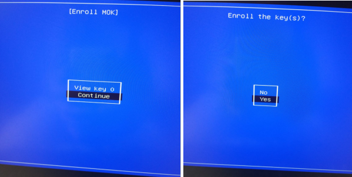
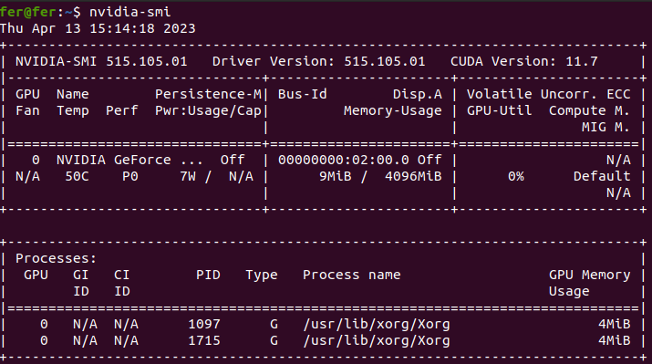
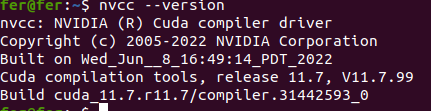
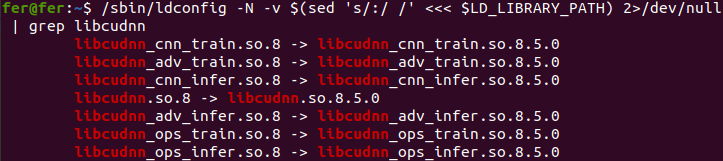

# Installation Guide
Here is a step-by-step guide on how to install and configure the required Nvidia drivers to be able to run Darknet-ROS on a Nvidia GPU to get real-time performance of the YOLO network

## Requirements
- Ubuntu 20.04.6 LTS
- ROS Noetic
- Nvidia GPU (for this particular example the GeForce GTX 1650 is used)
- CUDA: 11.7
- cuDNN: 8.5.0

## Pre-Install Actions

1. This steps were implemented in a clean install of Ubuntu with no Nvidia software previously installed. Please make sure you don't have any Nvidia drivers previously installed to avoid conflicts and if so purge them using the following commands: 
	
Check which nvidia packages are installed with: 

	dpkg -l | grep -i nvidia
	
Uninstall nvidia drivers:

	sudo apt-get remove --purge '^nvidia-.*'
	sudo apt-get autoremove
	
2. The installation of Nvidia drivers activates the BIOS secure boot, so it is also recomended to do this installation in a BIOS with the default values. The installation instructions in this guide were done on a notebook that had the BIOS reset to its default values. 

## Installation Steps

### **1. NVIDIA GPU DRIVER**

There are several methods to install the Nvidia drivers in Ubuntu: using the Software & Updates tool in Ubuntu, install via command line using apt, or downloading the .run file of the driver. The first option is recomended as it is the easiest and will be described in this guide.
More information on the other installation methods can be found here [Nvidia Drivers Installation in Ubuntu](https://phoenixnap.com/kb/install-nvidia-drivers-ubuntu#ftoc-heading-11)

**1.1** Find the recomended driver for your GPU here [Official Drivers | Nvidia](https://www.nvidia.com/download/index.aspx)

**1.2** Make sure the driver is compatible with CUDA 11.7

For the GPU in this this example, GeForce GTX 1650, the recomended driver (April, 2023) in the Nvidia webpage is 525 as it can be seen in the image in step 1.1 
This driver is **NOT** compatible with CUDA 11.7 as it can be seen in table 3 in [CUDA Compatibility](https://docs.nvidia.com/deploy/cuda-compatibility/)

**!!!So the previous driver release compatible with this GPU is going to be installed, the Nvidia driver 515.**
	 
	 
**1.3** Now that the driver version to be installed is identified, open the **Software & Updates** tool in Ubuntu and go to the **Additional Drivers** section. Select the desired driver and click on **Apply Changes**

**1.4** The system is going to give you a warning about the secure boot being enabled and ask you to set a password. Once this is done you need to reboot. 
	
	sudo reboot
	
**1.5** During reboot you will be asked to enroll the Mok key. Click on yes.

**1.6** Now you can check the correct installation of the drivers using the command:
	
	nvidia-smi	
	
And you should see something similar:

	
Altough a CUDA version is shown next to the driver version it is not installed yet. You can check this using the command:
	
	nvcc --version
	
### **2. CUDA**

There are several installation methods available to install CUDA in Ubuntu, however the deb(local) method is recomended. 
Installing CUDA in Ubuntu can be confusing due to the existance of several installation guides where there are slight variations in the instructions in each of the guides.

For instance, the instructions to install CUDA11.7 in Ubuntu20.04 using the deb(local) method can be found in the following 3 official nvidia guides:
1. [CUDA Toolkit 11.7, Download Installer for Linux Ubuntu 20.04 x86_64](https://developer.nvidia.com/cuda-11-7-0-download-archive?target_os=Linux&target_arch=x86_64&Distribution=Ubuntu&target_version=20.04&target_type=deb_local)
2. [NVIDIA CUDA Installation Guide for Linux](https://docs.nvidia.com/cuda/cuda-installation-guide-linux/index.html#download-the-nvidia-cuda-toolkit)
3. [CUDA Quick Start Guide, 3.1.8 Ubuntu](https://docs.nvidia.com/cuda/cuda-quick-start-guide/index.html#ubuntu)

In summary the steps to follow are: 

1.  pre-installation actions

1.1 download the Nvidia CUDA toolkit
	
	wget https://developer.download.nvidia.com/compute/cuda/repos/ubuntu2004/x86_64/cuda-ubuntu2004.pin
	
	sudo mv cuda-ubuntu2004.pin /etc/apt/preferences.d/cuda-repository-pin-600
	
	wget https://developer.download.nvidia.com/compute/cuda/11.7.0/local_installers/cuda-repo-ubuntu2004-11-7-local_11.7.0-515.43.04-1_amd64.deb

2. package manager installation

Starting April, 2022 to ensure the security and reliability of RPM and Debian package repositories, 
NVIDIA is updating and rotating the signing keys used by the apt package managers so the keys need to be updated to
avoid package management errors when attempting to access or install packages from CUDA repositories.

2.1 remove outdated signing key
	
	sudo apt-key del 7fa2af80
				
Install the new key 

	wget https://developer.download.nvidia.com/compute/cuda/repos/ubuntu2004/x86_64/cuda-keyring_1.0-1_all.deb
			
	sudo dpkg -i cuda-keyring_1.0-1_all.deb
				
2.2 local repo install 

a. install local repository in file system
	
	sudo dpkg -i cuda-repo-<distro>_<version>_<architecture>.deb
	sudo dpkg -i cuda-repo-ubuntu2004-11-7-local_11.7.0-515.43.04-1_amd64.deb
				
b. enroll ephemeral public GPG key

	sudo cp /var/cuda-repo-<distro>-X-Y-local/cuda-*-keyring.gpg /usr/share/keyrings/
	
	sudo cp /var/cuda-repo-ubuntu2004-11-7-local/cuda-*-keyring.gpg /usr/share/keyrings/
	
3. common installation instructions for ubuntu 

a. update apt repository cache
	
	sudo apt-get update
				
b. install cuda sdk
	
	sudo apt-get install cuda
				
c. Reboot system 

	sudo reboot

4. post-installation actions

4.1 environment set up

a. add path to PATH variable 

	export PATH=/usr/local/cuda-12.0/bin${PATH:+:${PATH}}

b. change the environment variables for 64-bit operating systems

	export LD_LIBRARY_PATH=/usr/local/cuda-12.0/lib64\
                     ${LD_LIBRARY_PATH:+:${LD_LIBRARY_PATH}}
		 
or 

	sudo nano ~/.profile
	add at the end of file
	if [ -d "/usr/local/cuda/bin/" ]; then
		export PATH=/usr/local/cuda/bin${PATH:+:${PATH}}
		export LD_LIBRARY_PATH=/usr/local/cuda/lib64${LD_LIBRARY_PATH:+:${LD_LIBRARY_PATH}}
	fi

	
Check version 

	nvcc --version
	
You must see something like: 

### **3. cuDNN**

The recomended method to install cuDNN is using  deb(local) install files. These files can be found in the [cuDNN Archive | NVIDIA Developer](https://developer.nvidia.com/rdp/cudnn-archive) page. 
In order to be able to download the files a developer account must be created. You will be asked to fill a survey and then you can download  the files. 

3.1 Make nvidia developer account

3.2 Download 3 files
	- Local Installer for Ubuntu20.04 x86_64 (Deb)
	- Local Installer for Ubuntu20.04 aarch64sbsa (Deb)
	- Local Installer for Ubuntu20.04 cross-sbsa (Deb)
	
	
3.3 In terminal go to the package location and install the 3 deb files (runtime library, developer library, and code samples)
	
	sudo dpkg -i cudnn-local-repo-ubuntu2004-8.5.0.96_1.0-1_arm64.deb

	sudo dpkg -i cudnn-local-repo-ubuntu2004-8.5.0.96_1.0-1_amd64.deb
	
	sudo dpkg -i cudnn-local-repo-cross-sbsa-ubuntu2004-8.5.0.96_1.0-1_all.deb
	
3.4 check cudnn version

	/sbin/ldconfig -N -v $(sed 's/:/ /' <<< $LD_LIBRARY_PATH) 2>/dev/null | grep libcudnn

3.5 Optional

If you cannot locate cudnn.h, or the later compilation fails with not found cudnn.h message:

Copy cudnn.h (in /usr/include) to (/usr/local/cuda/include):
	
	sudo cp /usr/include/cudnn.h /usr/local/cuda/include

Copy libcudnn* (in /usr/lib/x86_64-linux-gnu) to (/usr/local/cuda/lib64):
	
	sudo cp /usr/lib/x86_64-linux-gnu/libcudnn* /usr/local/cuda/lib64
 
 
 ### **4. ROS Configuration**

4.1 Install ROS [noetic](http://wiki.ros.org/noetic/Installation)
4.2 Set up [catkin_ws](http://wiki.ros.org/catkin/Tutorials/create_a_workspace)
4.3 Set SSH key for git if needed 
4.4 Clone this version of the repo with the recursive flag --recursive (bc there is a submodule)

	cd catkin_workspace/src
	
	git clone --recursive git@github.com:fernandaroeg/darknet_ros_CUDA11.7enabled.git
	
	cd ../
	
4.5 Build in release mode 

	catkin_make -DCMAKE_BUILD_TYPE=Release

### **5. configure darknet repo**

 5.1 enable flags, 
 
 5.2 set GPU architecture
 
 5.3 make, compile darknet library
 
 5.4 catkin_make, compile darknet_ros pkg

### **6. Test it **

imagen
